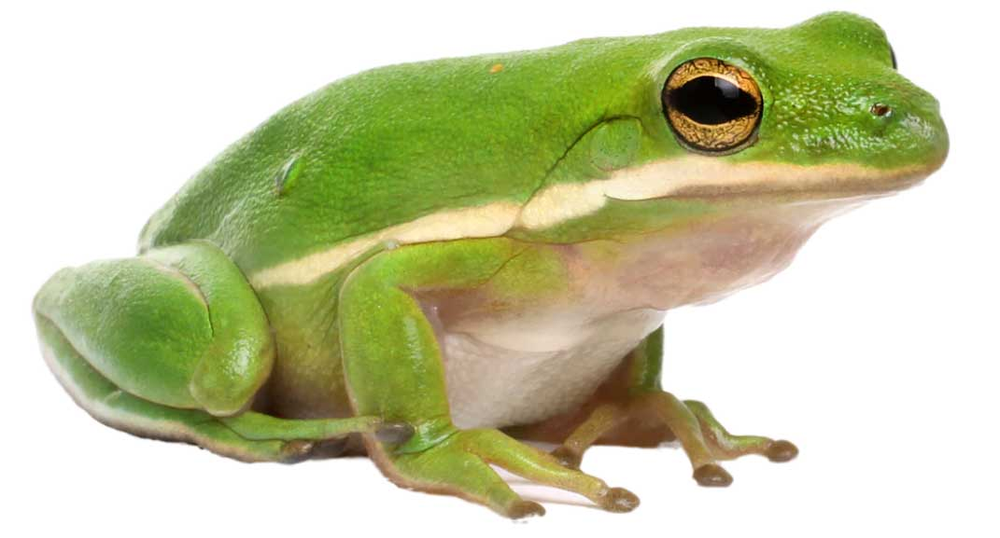
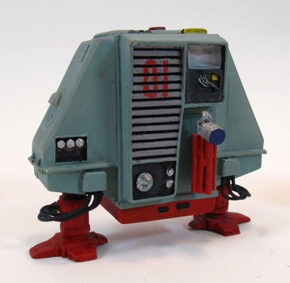

# Proko Resources

## Course: Drawing Basics
Course link: [Proko - Drawing Basics](https://www.proko.com/course/drawing-basics)
### Section: Lines
#### Project: Organizing Line Weight
Project link: [Project - Organizing Line Weight](https://www.proko.com/course-lesson/project-organizing-line-weight/assignments)
##### Additional reference material
###### Tree Frog
 
[source](https://reptichip.com/cdn/shop/articles/Best_substrate_for_an_American_Green_Tree_Frog_Hyla_cinerea_ReptiChip_aae0688d-7de2-431f-811b-cb3d91e4ec17_600x.png)
[redline (jpg)](treefrog-redline.jpg)
[non-photo-blue (jpg)](treefrog-nonphotoblue.jpg)
[Photoshop format (psd)](treefrog.psd)
###### Dewey

<ul>
 <li><em>Robot drone from 1972 Science fiction movie [Silent Running](https://en.wikipedia.org/wiki/Silent_Running)</em>
 <li>[source](https://www.monstersinmotion.com/cart/item-list-ah-c-22_183/huey-dewey-and-louie-botanist-maintenence-drones-resin-model-kit-p-8383.html)
 <li>[redline (jpg)](dewey-redline.jpg)
 <li>[non-photo-blue (jpg)](dewey-nonphotoblue.jpg)
 <li>[Photoshop format (psd)](dewey.psd)
<ul>
###### Notes
Redline color code: f9cdcc
Non-photo-blue color code: a4dded
